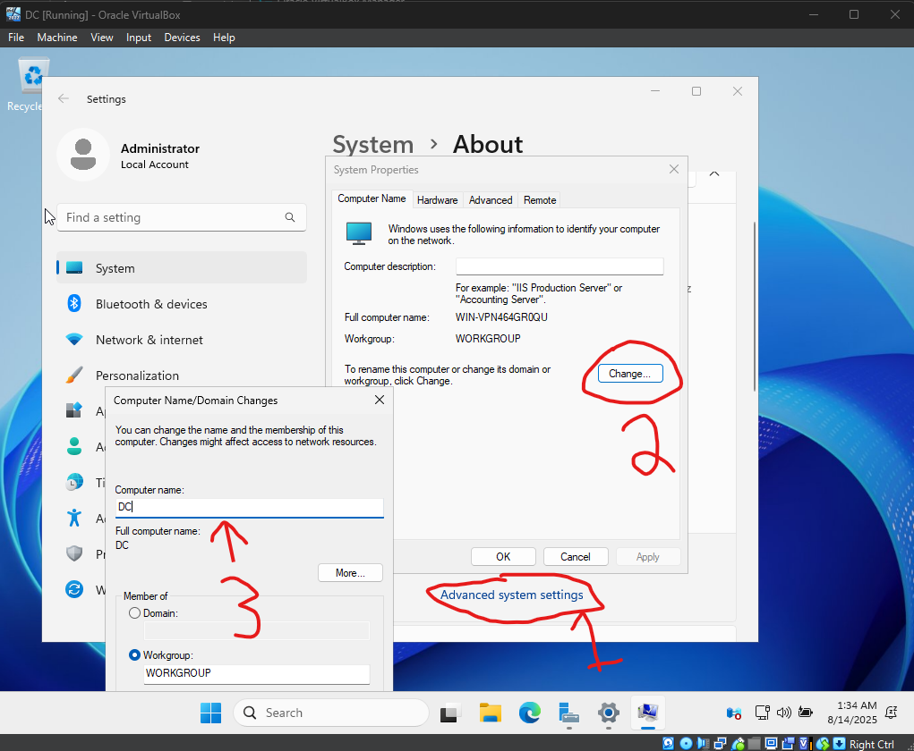
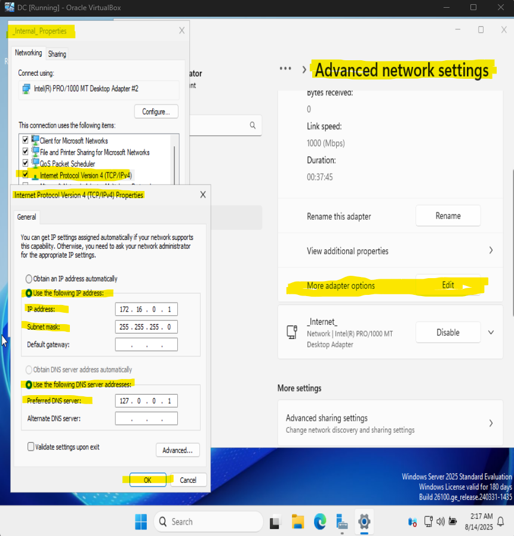

## 4. Pre-Active Directory Configuration (Critical Setup Steps)

Before I even touched the Active Directory installation, I made sure my server environment was properly set up. This step is non-negotiable — if the network and hostname aren’t configured right from the start, the domain will be unstable, DNS resolution will fail, and client machines won’t join properly.

---

### 4.1 Renaming the Server to `DC`
I renamed my Windows Server 2025 machine to `DC` so its role was clear. I like keeping my lab organized, and naming conventions are a big part of that.

**What I did:**
1. Right clicked on the **Start** → **System**.
2. Clicked on the *Advanced system settings*.
3. Clicked on **Computer Name** tab.
4. Click on the button that says **Change...**. (below are the screenshots in order and edited to show you exactly what to do)

---

### 4.2 Configuring the Internal Network Adapter
For my network setup, I used two adapters on my Domain Controller:
- **Adapter 1**: NAT for internet access.
- **Adapter 2**: Internal Network for domain traffic between my DC and Windows 10 client.
- **ScreenShots are at the bottom.**

**What I did:**
1. In **VirtualBox**, I went to the VM’s **Settings** → **Network**.
2. Set **Adapter 1** to NAT. I left everything else default. 
3. Set **Adapter 2** to **Internal Network** (I left the default name `intnet` and everything else default). **make sure to click on `Enable Network Adapter`.**
4. In Windows Server, I renamed this adapter to `_Internal_` so it’s easy to identify.

---

### 4.3 Assigning a Static IP (Internal Network)
In order for our Client1 (Win10) to connect to our domain, we need to give out second ethernet adapter (`_Internal_`) a static IP. Below are the address I utilized for this lab.:

**IP Address:** `172.16.0.1`
**Subnet Mask:** `255.255.255.0`
**Default Gateway:** *Left blank* (I didn’t need routing between networks)
**Preferred DNS Server:** `127.0.0.1` (self-referencing)

**What I did:**
1. In the bottom right corner of your VM, right click on the network emblem and select `Network and Internet settings`.
2. Click on `Advanced network settings`.
3. Look for `_Internal_` network adapter.
4. Click on the drop down to the right of the `Disable` button.
5. Scroll down to `More adapter options` and click on `Edit`.
6. Under the `Networking` tab and in the little window, look for `Internet Protocol Version 4 (TCP/IPv4) and **Double-click on it.**
7. Under `General` tab, for both sections, click on the option that starts with `Use the following...` to enter the above information manually.  

---

### 4.4 Verifying Connectivity
Before moving on, I made sure everything worked and referrred back to my network diagram to double check that my input information is correct. 
- Confirmed the `_Internal_` adapter had the correct static IP, subnet mask, and DNS.
- Verified the NAT adapter still had internet access by accessing google.com. 

---

### 4.5 Screenshots
To make this section visually clear, I included screenshots of:
- Renaming the server to `DC`
- VirtualBox network settings (showing NAT + Internal Network)
- Windows Server **Network Connections** with the `_Internal_` adapter highlighted
- IPv4 static IP configuration window

  
  
  

[ Back to Environment Setup](02-environment-setup.md) | [ Next: Active Directory Setup](05-ADDS-Setup.md)

