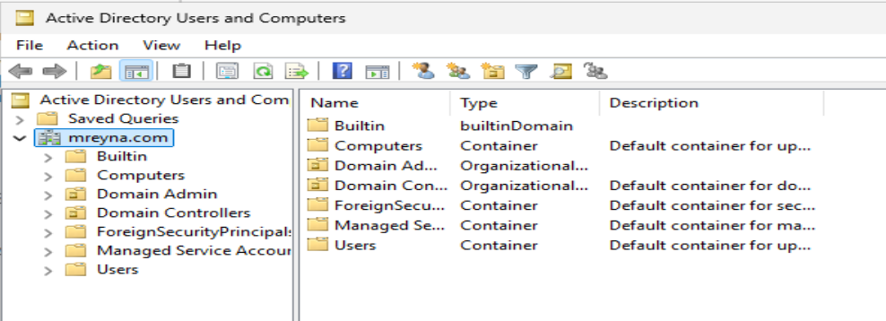
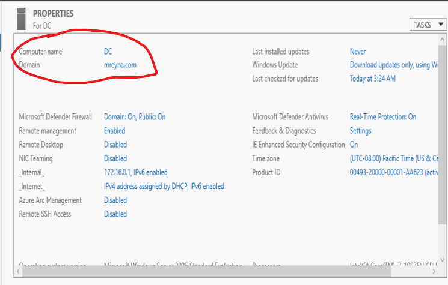

## 5. Active Directory, Remote Access, and DHCP Setup

Once my server was fully prepped, I moved on to the heart of this lab — setting up Active Directory Domain Services (ADDS) and configuring the supporting roles that make a domain functional in a real-world network.

---

### 5.1 Installing Active Directory Roles & Features
I started by opening **Server Manager** and using the **Add Roles and Features Wizard** to install the **Active Directory Domain Services (ADDS)** role. I followed these steps:

1. Launched **Add Roles and Features**.
2. Chose a **Role-based**.
3. Selected my server (`DC`).
4. Added the **Active Directory Domain Services** role.
5. Let the wizard install the necessary management tools.

---

### 5.2 Configuring the Domain
Once ADDS was installed, I promoted my server to a Domain Controller.

**Configuration details:**
- **New forest**: `mreyna.com`
- Domain Controller Options Page: **Forest functional level and Domain Fucnction level**: Default (Windows Server 2025 equivalent). DNS server and Global Catalog should be automatically selected. If not, select those two only. 
- **Directory Services Restore Mode (DSRM) password**: **Password1**
- DNS Options: **Ignore and click `Next`.
- Additional Options: NetBIOS should auto populate name for you. once it does, click `Next`.
- Paths: Leave at default and click next.
- Review Options: Review to make sure evrything is correct and then click on `Next`.
- Pre-Req: Allow for it to load. You get some warning but that is because we still havent finished setting up the rest of our AD. **Ignore and click `Install`.

After completing the wizard, the server restarted and I officially had my domain online.

If you have done the tasks stated above correctly, when you sign back in, your username should say something like `MREYNA/Administrator`.

---

### 5.3 Creating a Domain Admin Account
Using the **Active Directory Users and Computers (ADUC)** tool, I created a dedicated Domain Admin account instead of using the default `Administrator`. Under the Domain, I created a new Organizational Unit `Domain Admin`.

**Account details:**
- **Username**: `a-mreyna`
- **Password**: `Password1` *(Lab only — not secure for production)*
- **Password Policy**: Password never expires.

I also added `a-mreyna` to the **Domain Admins** OU. 

Conduct a **Manual** restart and sign in using the `Domain Admin` account. (This is for safety and security reasons. It is good practice to not be signed in as "God" mode unless you really have to. 

---

### 5.4 Setting Up Remote Access
I installed the **Remote Access** role so the we can enable **Remote Access Servives** (RAS) and **Network Address Translation** (NAT). the same configure steps are the same as the Active Directory Domain Service as well as the roles and features that follow.

**Here are the steps I took:**
1. Used **Add Roles and Features** to install **Remote Access**.
2. Server Selection: Make sure that the selected server from the server pool is us. 
3. Completed the wizard and verified the service started successfully.
4. Click `next` until you reach **Server Selection. Click **Remote Access**, it is located towards the bottom of the list.
5. Features and Remote Access: Click `Next`
6. Role Service: Select `DirectAccess and VPN (RAS)` and `Routing`. A pop up window should appear after selecting `DirectAccess and VPN (RAS)`, click `add features`. Click `Next`.
7. Hit next until you reach the confirmation window and then click `Install`.
8. After it has finished installing the **Remote Access** roles and features, close the window and click on `Tools` at the top right corner. (Ignore the warning sign by the flag)
9. In the `Tools` tab, go down until you see `Routing and Remote Acces`, click on it.
10. Once inside the page, hover your mouse over the `DC(local)` tab to the left of the window, right click, and then click on `Configure and Enable Routing and Remote Access`.
11. Wizard window should appear, click `Next`. On the next page, select `Network address translation` (it is the second selection under `Remote access (dial-up or VPN)`). Click `Next`
12. NAT Internet Connection: 90% of the time, our **Network Interfaces wont appear in the box and it is unselectible. Click `Cancel`, close out the `Routing and Remote Access` window, and repeat the proccess starting from step 9. (it should work once you try again.)
13. NAT Internet Connection pt.2: Click on the first option and select our internal ethernet `_Internal_`. Verify that the IP is **172.16.0.1**
14. Summary: Click `Finish`.
15. As soon as it brings you to the Remote access page again, right click on `DC(Local)` and click on `Enable DirectAcces`. Right click again and hit `Refresh`.
16. **Manual** Restart my VM
---

### 5.5 Configuring DHCP
Finally, I set up DHCP to automatically assign IP addresses to domain-joined clients.

1. Again, click on **Add roles and features**.
2. Click `Next` until you reach **Server Roles**.
3. Select `DHCP Server`.
4. Add features and click `Next`.
5. Click `Next` until the **Confirmation**, then click `Install`. Click `Close`. 
6. Go to **Tool**, Click **DHCP**, and then, on your left side, click on the drop down for `dc.domainname`. You should see that both IPv4 and v6 have red arrows.
7. Drop down on IPv4, hover over it and select `New Scope...`. Start the Wizard.
8. I utilized the information below to configure my scope.  

**Configuration details:**
- **Scope Name**: `Scope1`
- **Desc**: **leave blank**
- **IP Range**: `172.16.0.100` to `172.16.0.200`
- **Length**: 24
- **Subnet Mask**: `255.255.255.0`
- **Skip exclusions by clicking `Next`. (unless you have IPs with in our rage you don't to have access to our server).
- **Lease Duration**: Because this is a lab, have it expire in a week. longer if you want. I chose **8 Days**.
- **Configure...** Choose `Yes` and click `Next`. 
- **Default Gateway**: `172.16.0.1` (Domain Controller’s IP) **CLICK `ADD` ON THE RIGHT OF THAT IN PUT AND VERIFY ITS IN THE LARGER BOX**. `Next`.
- **Domain Name and DNS Server**: Verify that your parent domain is correct and that your Default gateway is added. it should be automatically in the box. It should be 176.16.0.1. If not, add it utilizing the IP input section right on top. Click `Next`. You can leave servername blank.
- Skip WINS. It's an outdated server and we won't use.
- Yes, activate scope and finish.
- Click on the flag to do the `Post-Config`. Click on the DHCP Post-config to start it.
- `Next` on Decription. Use your **Domain Admnin** credentials. `Commit`. Close summary.
- Go back to **DHCP Tools**. Drop down until you see your domain IPv4 and v6 are **Green arrows up**.
- **Manual** Restart. 

Once the scope was activated, my Windows 10 client could get an IP address automatically from the Domain Controller.

---

### 5.6 Screenshots
To help recruiters and viewers follow along visually, I included:
- **ADDS Installation Wizard**
- **Domain Promotion Settings**
- **a-mreyna Account Creation in ADUC**
- **Remote Access Role Installation**
- **DHCP Scope Configuration**

  
  
  
  

---

At this stage, my lab had a fully functional domain with user management, automatic IP assignment, and routing capability — all configured manually, just like in a real enterprise environment.

---

[ Back: Pre-Active Directory Configuration (Critical Setup Steps)](Pre-Active-Directory-Configuration-(Critical-Setup-Steps).md) | [ Next: Windows 10 (Client1) Setup](06-Windows-10-Setup.md)
