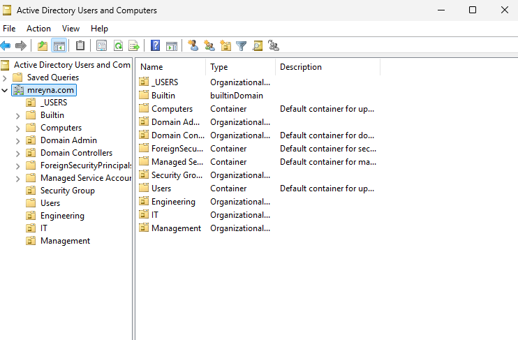
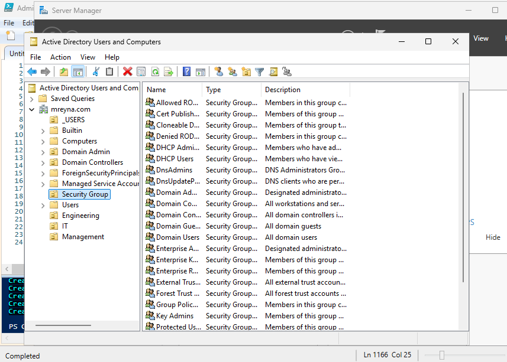
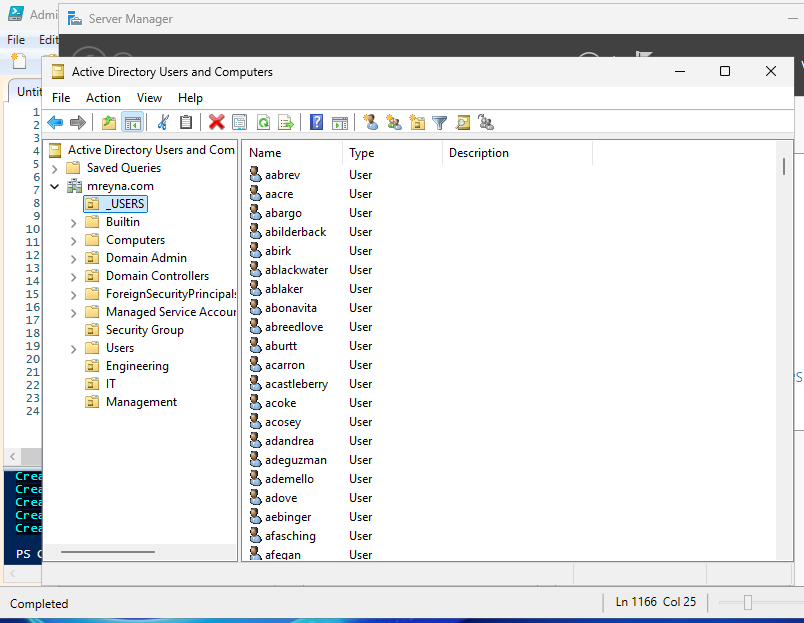
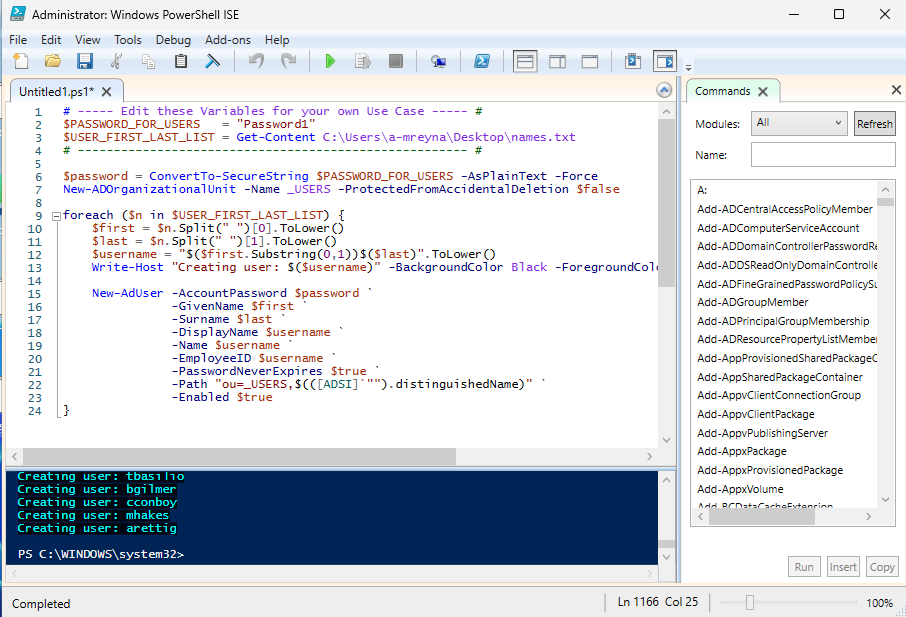
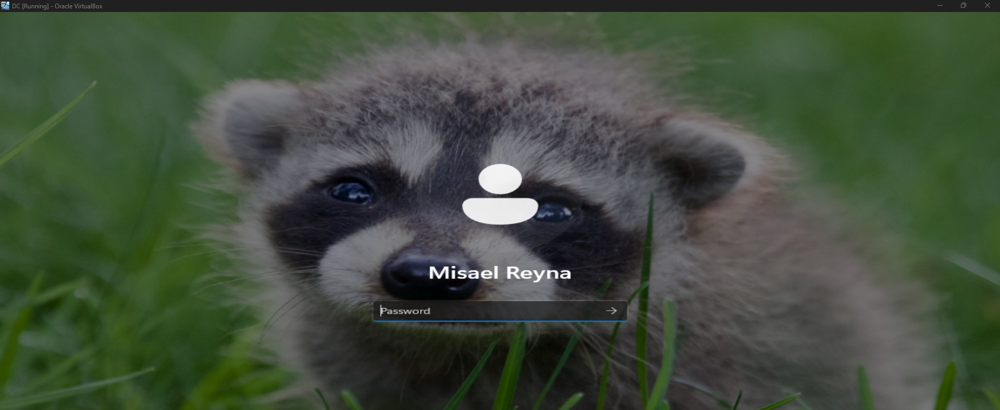

 – Creating Users, Groups, and Organizational Units (OUs)

With the domain fully operational, I shifted focus to building out the Active Directory structure for users, groups, and OUs. This step is critical in any enterprise environment because it lays the foundation for security, scalability, and daily administrative efficiency.

### Organizational Units (OUs)
I began by designing a logical OU hierarchy to separate accounts based on their function and security needs. I created dedicated OUs for:
- **Departments** (IT, Engineering, and Management) for applying department-specific Group Policy Objects (GPOs)
- **Service Accounts** to isolate non-human accounts with unique security considerations
- **Administrative Roles** for privileged accounts requiring stricter access controls

This structure makes it easy to target GPOs, apply permissions, and troubleshoot issues without impacting unrelated accounts.

### Groups
I created a groups within each department and assigned a manager per group. Each group having their own share folder titled **Xshare** 

### User Accounts
I then created user accounts using a standardized naming convention (e.g., first initial + last name) for easier identification and management. Each account was populated with:
- Username and display name- Department information
- Appropriate group memberships

For administrative accounts, I applied specific settings such as “Password never expires” (only where operationally justified) and enabled additional security controls.

Everyone else is designated a random password. I applied the setting for them to change their password upon first logon. 

### PowerShell Automation (Mass)
To speed up provisioning and reduce human error, I used a PowerShell script to:
- Bulk-create multiple user accounts at once
- Assign the correct security group memberships
- Place each account into the right OU automatically

### PowerShell Automation (Single)
For a single user creation, I created a PowerShell script that allows for a more specific configuration. The script automatically assigns a random password to each new user. It also stores the information (name, username, password, etc.) into a secure file on the admin account. 

These automation not only mirrors real-world onboarding workflows but also demonstrates the importance of scripting in large-scale and security specifications in operations. 

### GPO practice for all user accounts
As a fun excersise to get familiar with creating GPOs, I enabled **Force a specific default lock screen and logon image**, **Prevent changing Desktop background**, **Force specific screen saver**, and **Prevent changing lock screen and logon image**. That way, authorized domain users and computers are welcomed with a baby raccoon wallpaper and cannot change it if they feel indifferent about raccoons. 

### Outcome
The result is an Active Directory environment that is:
- **Organized** with a clear and scalable OU hierarchy
- **Secure** through RBAC and adherence to the principle of least privilege
- **Efficient** thanks to automation-driven provisioning
- **Ready for growth**, making it easy to onboard new hires or restructure departments without disruption

### Skills Demonstrated
- Active Directory design and administration
- Group Policy Object (GPO) targeting and practices
- Role-Based Access Control (RBAC) implementation
- User provisioning and lifecycle management
- PowerShell scripting for automation
- Enterprise security best practices

---
## PowerShell Scripts Used
-The mass user creation script was created by Josh Madakor. Here is his GitHub page with the files: https://github.com/joshmadakor1/AD_PS

-Here is the script I made: 
[Script for creating new AD users with random password assignment and information log](../Scripts/Create_New_ADUser.ps1) 

## Screenshots

Below are screenshots showing the OU structure, security groups, and user accounts as configured in this section.

**-OU Structure**

**-Security Groups**

**-User Accounts**

**-PowerShell Automation Output**

**-GPO practice for all user accounts**

